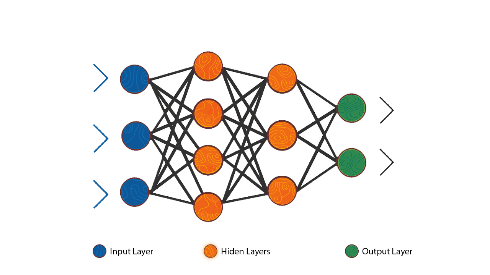

# Neural Networks From Scratch

🌟 Implementation of Neural Networks from Scratch Using Python &amp; Numpy 🌟

<p align="center">
  
</p>

> Uses Python 3.7.4

#### This repository has detailed math equations and graphs for every feature implemented that can be used to serve as basis for greater, in-depth understanding of Neural Networks. Basic understanding of Linear Algebra, Matrix Operations and Calculus is assumed.

## Contents 📑

- [Core Concepts](./core)
- [Activation Functions](./activations)
- [Loss Functions](./loss)
- [Optimizers](./optimizers)

## Setup 💻

```bash
git clone <url>
pip install -r requirements.txt
```

Here, Keras is used just to load the MNIST dataset

## Usage 📔

- Tune hyperparameters in `config.py`
- Run the following command

```bash
python main.py
```

#### Output:

<pre>
$ python main.py
epoch 1/30      error=0.173172
epoch 2/30      error=0.077458
epoch 3/30      error=0.058955
epoch 4/30      error=0.048161
.....
.....
.....
epoch 26/30     error=0.010333
epoch 27/30     error=0.009944
epoch 28/30     error=0.009602
epoch 29/30     error=0.009298
epoch 30/30     error=0.009045

Predicted Values: 
[array([[-4.31825197e-04, -1.80361575e-03,  6.84263430e-03,
        -1.42045839e-02, -1.32599433e-02, -3.67077777e-02,
         3.73258781e-02,  <b>0.97446495</b>,  4.59079629e-02,
        -8.94465105e-03]]), 
array([[ 0.0461294 , -0.00845601,  <b>0.8578162</b> , -0.00272202,  0.01397735,
         0.17131938,  0.21350745, -0.06529926,  0.01975232, -0.10840968]])]
True Values: 
[[0. 0. 0. 0. 0. 0. 0. 1. 0. 0.]
 [0. 0. 1. 0. 0. 0. 0. 0. 0. 0.]]
</pre>

## Roadmap 📑

- [x] Basic Activation Functions
- [x] Basic Loss Functions
- [x] Gradient Descent
- [x] Layer Architecture
- [x] Wrapper Classes
- [x] Hyperparameters Configuration
- [ ] Exotic Functions
  - [ ] SoftMax Activation
  - [ ] Gradient Descent w/ Momentum
  - [ ] RMSProp Optimizer
  - [ ] Adam Optimizer
  - [ ] CrossEntropy Loss Function
  - [ ] GeLu Activation
- [ ] Regularization
- [ ] Clean Architecture
- [ ] UI (Similar to Tensorflow Playground)

##### This project is not meant to be production ready but instead serve as the foundation repository to understand the in-depth working of Neural Networks down to the mathematics of the task.

###### Collaborations in implementing and maintaining this project are welcome. Kindly reach out to me if interested.

## References 📚

- Deep Learning Specialization, Andrew NG - Coursera
- [Machine Learning Cheatsheet](https://ml-cheatsheet.readthedocs.io/en/latest/index.html)

> &copy; 2020 Ryan Dsilva
