# Neural Networks From Scratch

🌟 Implementation of Neural Networks from Scratch Using Python &amp; Numpy 🌟

> Uses Python 3.7.4

## Activation Functions

Activation functions live inside each neuron in the neural network layers and modify the data they receive before passing it to the next layer. Activation functions give neural networks their power  by  introducing non-linearity, allowing them to model complex relationships.

`x: input`

- Identity

    
     
    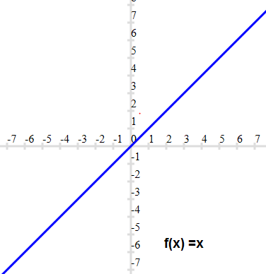

- BinaryStep

    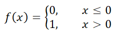0 \end{cases}" />
     
    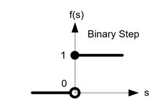

- Linear

  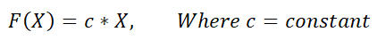
   
  

- Sigmoid

  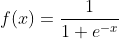
   
  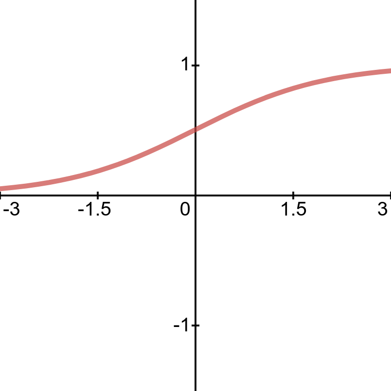

- Hyperbolic Tangent (tanh)

  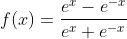
   
  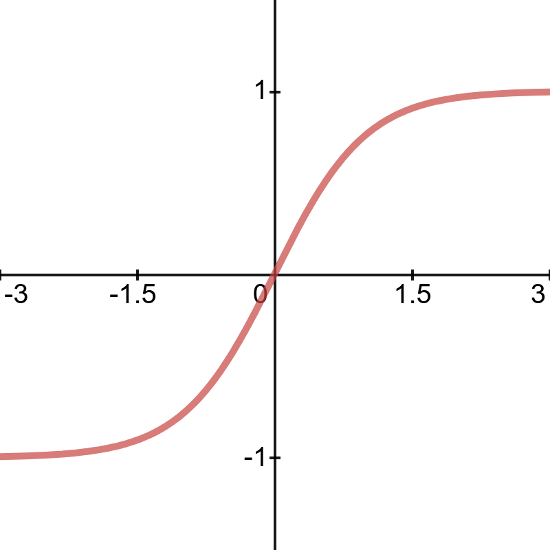

- Rectified Linear Units (ReLU)

  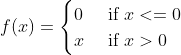0 \end{cases}" />
   
  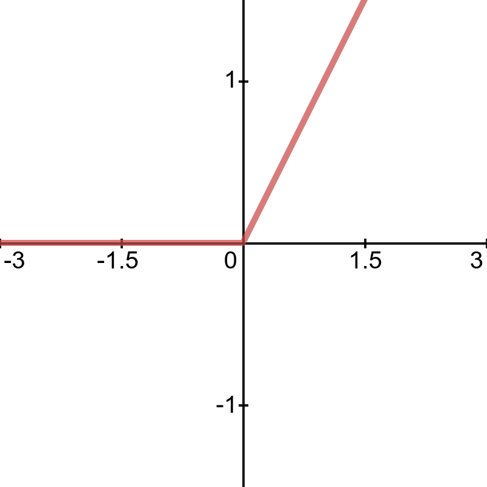

- Leaky Rectified Linear Units (LeakyReLU)

  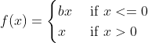0 \end{cases}" />

  `where b is a small constant`

   
  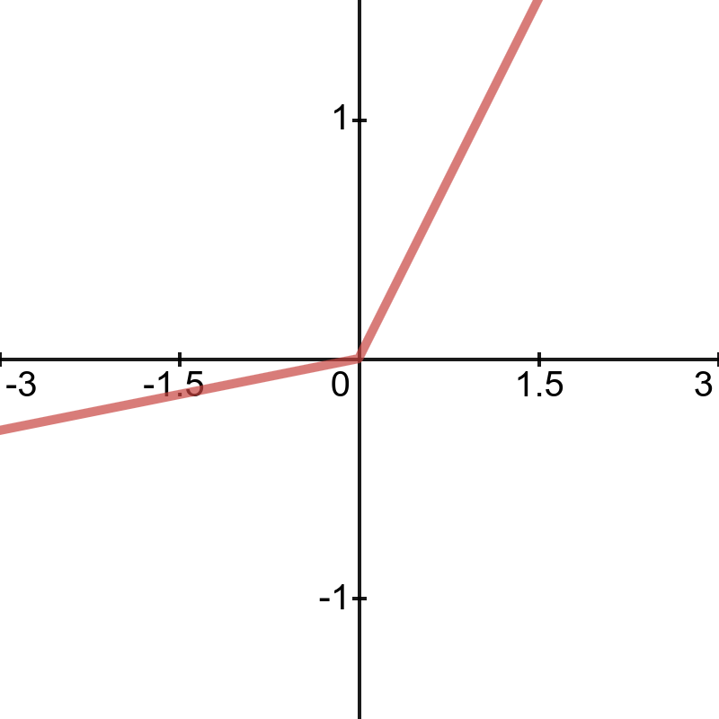

- Softmax

  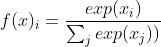
   

- Gaussian Error Linear Units (GeLU)

  `err: error function`

  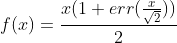
   
  
