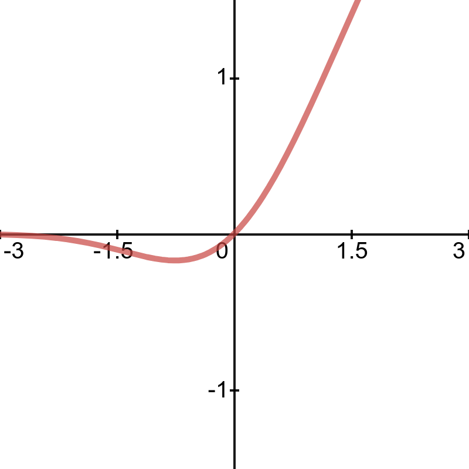

# Neural Networks From Scratch

🌟 Implementation of Neural Networks from Scratch Using Python &amp; Numpy 🌟

> Uses Python 3.7.4

## Activation Functions

- Linear

  
   
  

- Sigmoid

  
   
  

- Hyperbolic Tangent (tanh)

  
   
  

- Rectified Linear Units (ReLU)

  0&space;\end{cases}" title="f(x) = \begin{cases} 0 & \text{ if } x<= 0 \\ x & \text{ if } x>0 \end{cases}" />
   
  

- Leaky Rectified Linear Units (LeakyReLU)

  0&space;\end{cases}" title="f(x) = \begin{cases} bx & \text{ if } x<= 0 \\ x & \text{ if } x>0 \end{cases}" />

  `where b is a small constant`

   
  

- Softmax

  
   

- Gaussian Error Linear Units (GeLU)

  
   
  
