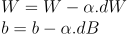

# Neural Networks From Scratch

🌟 Implementation of Neural Networks from Scratch Using Python &amp; Numpy 🌟

> Uses Python 3.7.4

## Core

A neural network takes an input, passes it through multiple layers of hidden neurons, and outputs a prediction representing the combined input of all the neurons.

#### Neuron

A neuron takes a group of weighted inputs, applies an activation function, and returns an output.

> Sigmoid is the activation function used in the picture

There is also a bias term `b` that is added to the `sum of weighted inputs` before applying activation function.

#### Forward Propogation

Input data is “forward propagated” through the network layer by layer to the final layer which outputs a prediction.

`W: weights | X: input | b: bias term | phi: activation function`

#### Backpropagation

Backpropagation refers to the method of calculating the gradient of neural network parameters. In short, the method traverses the network in reverse order, from the output to the input layer, according to the chain rule from calculus.

`dZ_o: gradient of output layer | A: activation output | Y: Actual Output | phi': derevative of activation function | dZ: gradient of current layer outputs | W: weights | Z: sum of weighted inputs for current layer | dW: weights gradient | dB: bias gradient | n: number of samples`

> superscript T denotes matrix transpose

#### Update Weights

The weights of each layer are then updated based on the gradients and learning rate using any one of the optimization algorithms, most basic being `Gradient Descent`.

This process happens for each neuron in each layer. This is the `learning process`.
