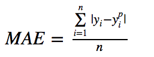
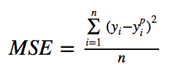
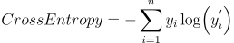

# Neural Networks From Scratch

🌟 Implementation of Neural Networks from Scratch Using Python &amp; Numpy 🌟

> Uses Python 3.7.4

## Loss Functions

- Mean Absolute Error (MAE)

  

- Mean Squared Error (MSE)

  

- CrossEntropy

  
