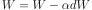
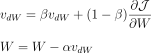
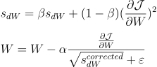
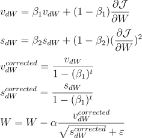

# Neural Networks From Scratch

🌟 Implementation of Neural Networks from Scratch Using Python &amp; Numpy 🌟

> Uses Python 3.7.4

## Optimizer Functions

Optimizer Functions help us update the parameters in the most efficient way possible. Optimizers update the weight parameters and bias terms to minimize the loss function to achieve global minimum.

- Gradient Descent

  

  `W: weights | dW: weights gradient (obtained from loss function) | alpha: learning rate`

- Gradient Descent with Momentum

  

- RMSProp

  

- Adam

  
